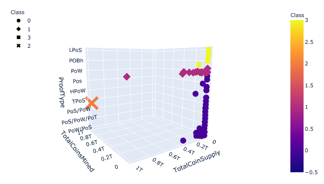
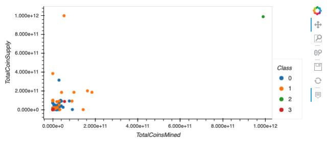

# Unsupervised Machine Learning Models of Cryptocurrencies

## Project Overview
The purpose of this project was to use unsupervised machine learning to group cryptocurrencies by the parameters "total coin supply", "total coins mined", "proof type" and "algorithm". Groups may then be used for further analysis. 

## Method
Data was retrieved from CryptoCompare and cleaned. Data was standardized by scaling and principal component analysis (PCA) was performed to optimize variables for machine learning. An elbow curve was generated to identify the optimal number of groups (i.e. clusters or classes). K-means analysis was performed to sort data into the groups. Finally, results were visualized by 3D and 2D scatter plots using Plotly and hvplot. See  for analysis details. 

## Results & Conclusions
The optimal number of groups identified for further analysis was four. Figure 1 and 2 show that there are two data points that stand out from the rest of the dataset: 
(1) BitTorrent, the only coin with a high total coin supply and total coins mined, and
(2) TurtleCoin, which has a high total coin supply but low total coins mined.
The remainder of the dataset has relatively low total coin supply and low total coins mined. 

If the dataset is viewed from this perspective, then there are three groupings. Four groupings would further sort the dataset by Proof Types. Click  for a list of the 532 grouped cryptocurrencies.

Figure 1. 3D Plot of Cryptocurrency Groups

Figure 2. 2D Plot of Cryptocurrency Groups

## Resources
### Data
-  (original dataset from CryptoCompare)

- 

### Software
Python 3.8.2, Jupyter Notebook 6.0.3, scikit-learn 0.23.1, scipy 1.4.1,pandas 1.0.5, plotly 4.8.2, and hvplot 0.6.0